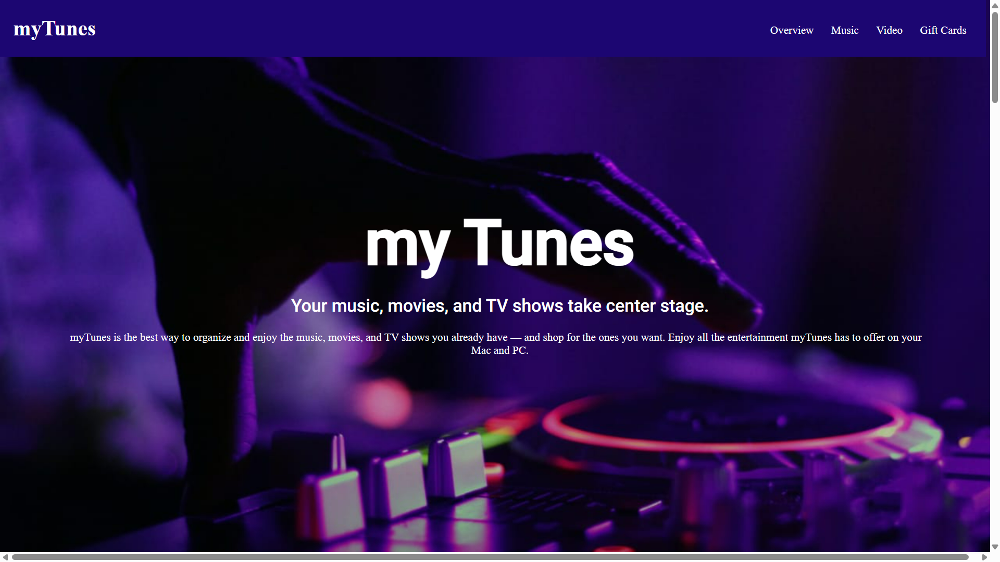
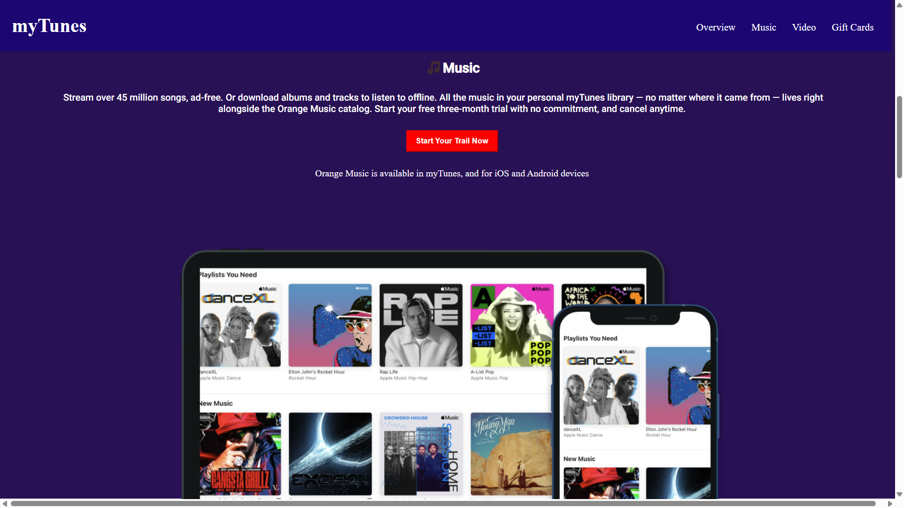
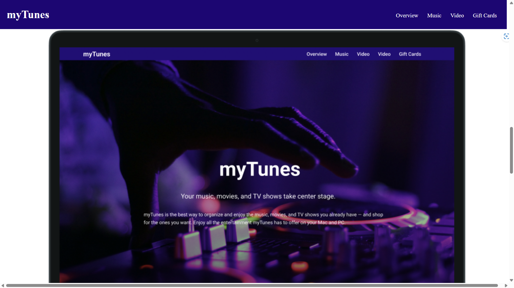
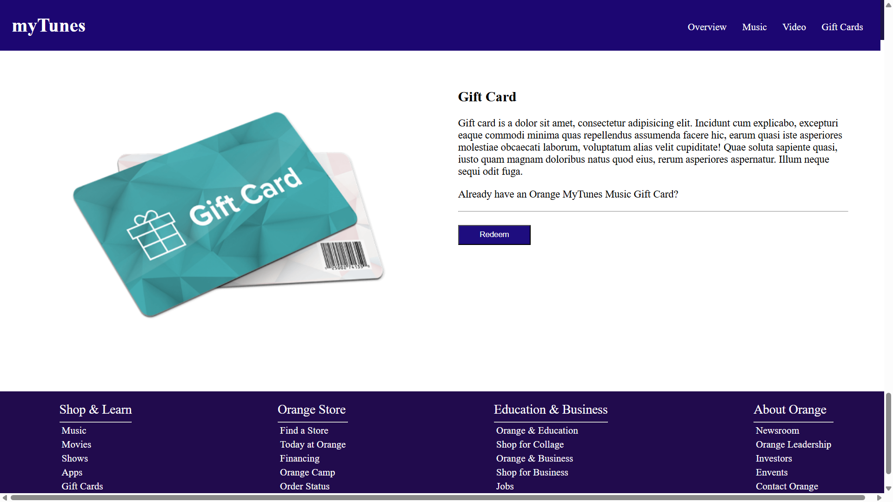

# MyTunes

MyTunes is a simple web application built using HTML and CSS. It provides a platform for music enthusiasts to explore music, watch videos, and send gift cards to friends and family.

## Overview

The Overview section of MyTunes gives a brief introduction to the application, its purpose, and key features. Users can quickly understand what MyTunes offers and how to navigate through different sections.

version 1 is hosted [HERE!](https://anandraj012.github.io/myTunes/)
## Music

In the Music section, users can browse through a collection of songs, albums, and playlists. They can listen to previews, add songs to their favorites, and create personalized playlists. MyTunes offers a seamless music listening experience.

## Video

The Video section of MyTunes allows users to watch music videos, interviews with artists, and behind-the-scenes footage. It enhances the user experience by providing visual content related to their favorite music.

## Gift Card

MyTunes offers a unique Gift Card feature where users can send digital gift cards to their friends or family members. They can choose from different designs, add a personalized message, and specify the gift card amount. It's a convenient way to share the joy of music with loved ones.

## Getting Started

To run MyTunes locally, follow these steps:

1. Clone the repository to your local machine.
2. Open the `index.html` file in your web browser.
3. Explore the different sections of MyTunes.

## Screenshots






<!-- ## License -->
<!-- MyTunes is licensed under the MIT License. See the [LICENSE](LICENSE) file for more details. -->
### Installation

1. Clone the repository:
   ```sh
   git https://github.com/ANANDRAJ012/myTunes.git
   cd myTunes

Feel free to explore and build upon this project to create a fully functional mytunes application. For any questions or assistance, please don't hesitate to reach out to us. Happy coding and happy shopping!


